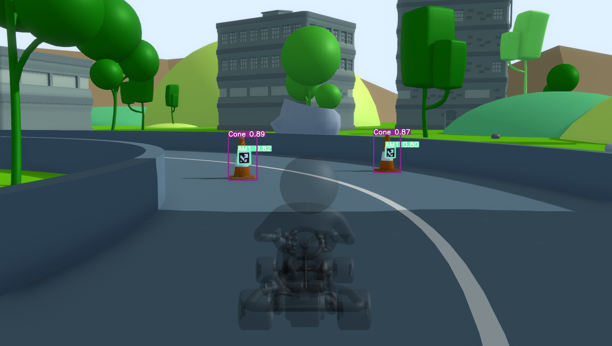

# Description

The Huff Research Group is built around the premise that innovation is a hands-on activity. We leverage creativity and technical expertise to apply this philosophy and take our transformative concepts in engineering, art, science, and technology from theory into practice.

## Rationale

While enrolled in engineering programs, it is crucial for students to develop several facets of their professional profiles.
Important dimensions of their education include teamwork, programming and marketing skills, time management, and leadership.
The Autonobot project complements the traditional classroom experience with weekly engineering meetings and an environment akin to the workplace.
It offers workshops centered on specific topics and skills.
In addition, participants are involved in design tasks.
Each tasks explores a fundamental concept in engineering and/or computer science.
Students are accountable for design decisions, progress reports, and they must produce deliverables upon completion of every phase of their projects.
Altogether, this offers an exceptional opportunity for members to work on all aspects of their future career.

## Tutorials

Students who partake in the Autonobot are expected to generate concise tutorials on the techniques, software applications, and platforms frequently employed in the project.
This in itself is a valuable learning experience, and it benefits future generations of participants by helping them get started with various aspects of engineering.
In this sense, the Autonobot subscribes to a teaching philosophy that strives to align deliverables and valuables.
